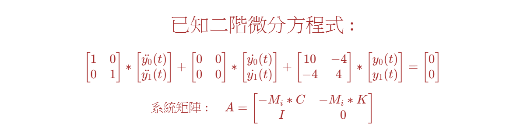
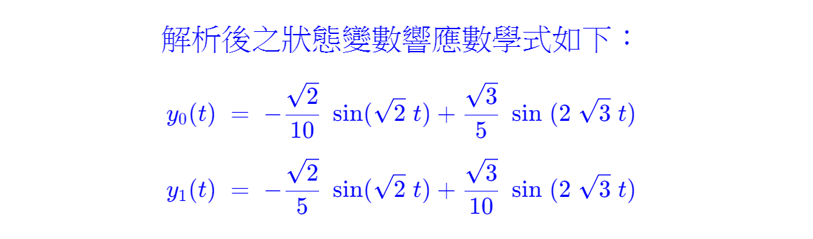
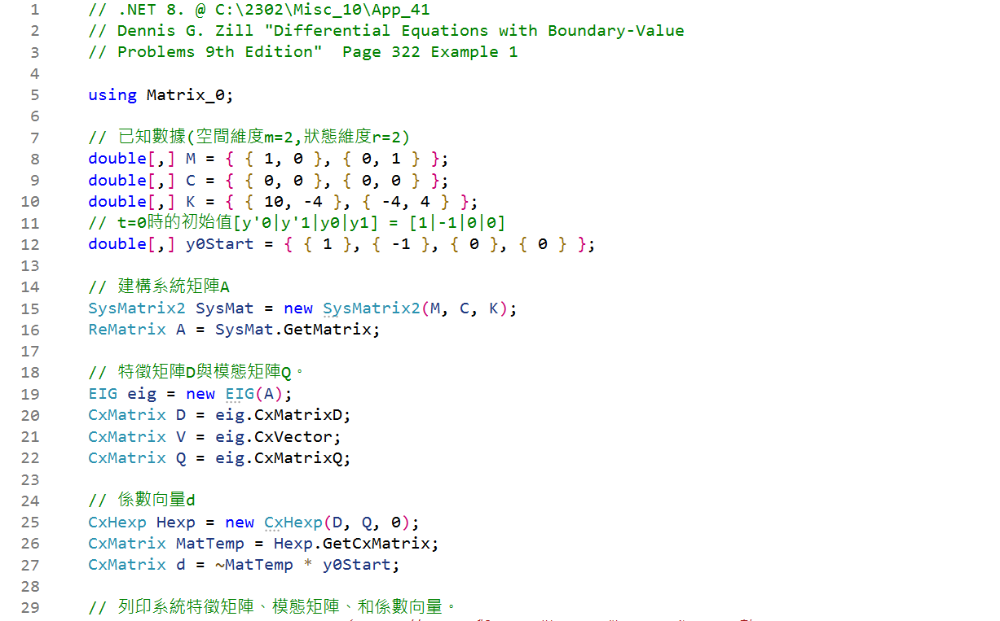
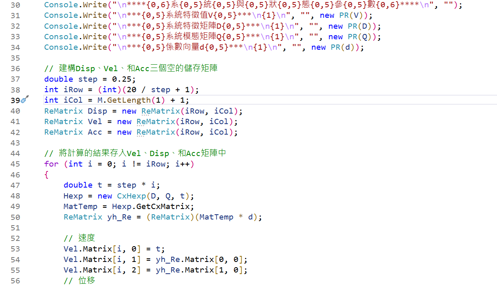
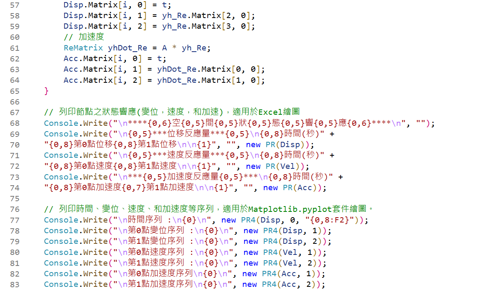
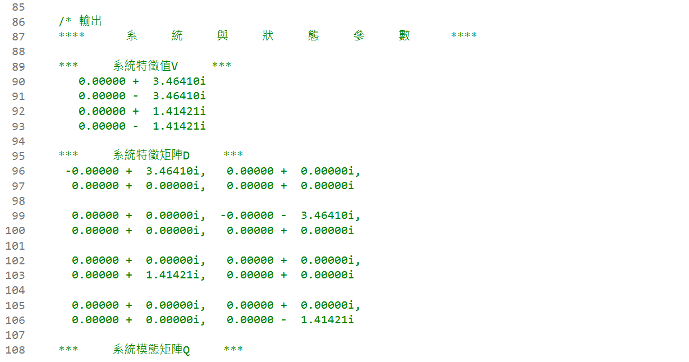

<!--    ConsoleApp41      -->

  

<!--     
#
# \[{   \color{Fuchsia} 精\;銳\;矩\;陣\;計\;算\;求\;解\;器  }\]  
## \[{  \color{Green}  【Sharp \; Matrix \; Solver \quad \; S\; M\; S】 }\]
-->  

  
<!--    
#### \[{  \color{Brown} Dennis \; G. \; Zill  }\]
#### \[{  \color{Brown} Differential\; Equations \; with \; Boundary-Value \; Problems \; 9th \; Edition  }\]   
#### \[{  \color{Brown} 第 \; 322 \; 頁 \; 至 \; 第 \; 323 \; 頁  }\]
# 
-->  

---  

#  
  
<!--    
### \[{   \color{Brown} 已知二階微分方程式 : }\] 
##### \[{  \color{Brown}  \begin{bmatrix} 1 & 0 \\ 0 & 1 \end{bmatrix} \ast \begin{bmatrix} \ddot{y_0}(t) \\ \ddot{y_1}(t) \end{bmatrix} + \begin{bmatrix} 0 & 0\\ 0 & 0 \end{bmatrix} \ast \begin{bmatrix} \dot{y_0}(t) \\ \dot{y_1}(t) \end{bmatrix} + \begin{bmatrix} 10 & -4\\ -4 & 4 \end{bmatrix} \ast \begin{bmatrix} y_0(t) \\ y_1(t) \end{bmatrix}= \begin{bmatrix} 0 \\ 0 \end{bmatrix}  }\] 
#####  \[{   \color{Brown} 系統矩陣: \quad A = \begin{bmatrix} -M_i\ast C & -M_i\ast K \\ I & 0 \end{bmatrix}  }\] 
-->  


  
<!--   
#####  \[{   \color{Brown} 即 \quad A = \begin{bmatrix} 0 & 0 & 10 & -4 \\ 0 & 0 & -4 & 4 \\ 1 & 0 & 0 & 0 \\ 0 & 1 & 0 & 0 \end{bmatrix} }\]
##### \[{   \color{Brown} 初始值@t = 0 \quad \begin{bmatrix} \dot{y_0}(t)\\ \dot{y_1}(t)\\ y_0(t)\\ y_1(t) \end{bmatrix} = \begin {bmatrix} 1 \\ -1 \\ 0 \\ 0  \end{bmatrix}   }\] 
-->  

  
<!--    
###  \[{  \color{Blue}  解析後之狀態變數響應數學式如下 ：  }\]
####  \[{  \color{Blue} y_0(t) \; = \; - \frac { \sqrt 2 } { 10 } \; \sin ( \sqrt{2} \; t ) + \frac {\sqrt 3} {5} \; \sin \; ( 2 \; \sqrt 3 \; t )     }\]
####  \[{  \color{Blue} y_1(t) \; = \; - \frac { \sqrt 2 } {5} \; \sin ( \sqrt{2} \; t ) + \frac {\sqrt 3} {10} \; \sin \; ( 2 \; \sqrt 3 \; t )     }\]
-->

> **解此矩陣微分方程式(m=2,r=2)**
>
> **電機系的```訊號與系統```、機械系的```控制系統```、和土木系的```結構動力學```，都有相同的求解方法。**
>
> **譬如```訊號與系統```使用Laplace Transform、Fourier Transform、或是Z Transform等等。**
>
>
> ***空間維度【Space Dimension】有二個自由度Degree of Freedom(m = 2)，狀態維度【State Dimension】有二個自由度，即二階微分(r = 2)，時間維度【Time Dimension】僅有一個連續性的時間自由度，可以任意選取時間，整體【系統矩陣】為(mXr)X(mXr)即4X4的實數矩陣，響應變數共有mX(r+1)個。C#程式碼的名稱空間(namespace)是引用```Matrix_0.dll```類別庫檔案，程式碼的開頭為```using Matrix_0；```***
>
> ***系統矩陣[A]是實數，但特徵矩陣[D]和模態矩陣[Q]，其預設值是複數矩陣(Complex Matrix)，整個運算都是使用複數矩陣的計算，最後輸出的結果雖然是複數，其虛數值為零，故可轉爲實數。***  
>
>
## 輸出結果與視覺化的圖示，參見本儲存庫  











##
